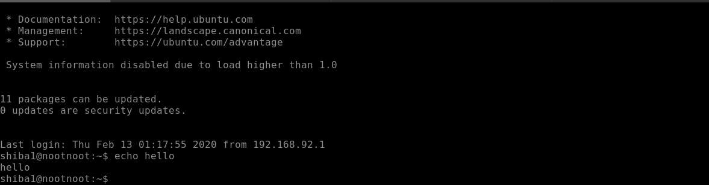
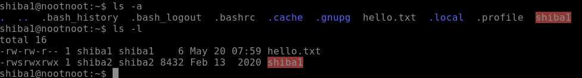
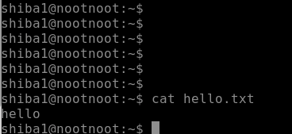

# Linux Fundamentals Part 1 

## Description 
Get introduced to the basics of Linux by learning how to use fundamentally important commands. Put this into practice by deploying and accessing your own remote (web-based) Linux machine.

Also available on [YouTube](https://youtu.be/fz-ybaXdlGU) 

## Task 1 - Intro
This room teaches the student about basic Linux concepts and built in tools.
A requirement for successful completion of this task is to deploy the Virtual Machine attached to this task. This can be done in two ways - an in-browser deployment if the student is willing to shell out the $10 for a premium subscription. If this is not a viable option, the student is also able to gain connection by connecting via a an OpenVPN configuration file. More information on this connection method can be found [here](https://tryhackme.com/room/openvpn).

## Task 2 - Methodology - no answer needed

## Task 3 - Basic Command Execution - no answer needed
This activity is undertaken through a headless Ubuntu Virtual Machine (VM is spun up through the command line as opposed to a GUI version). Having successfully logged on, we attempt our first command - echo. In a similar fashion to an echo in it's literal sense, any text following the echo command will be ouput in a new line.

## Task 4 - Manual Pages and Flags
Many of the commands that you will come across might sound unfamiliar at first. Fret not! This is where the Manual page (depicted by the `man` command and following the syntax [man "command"] helps. Many of these commands come with options, also known as 'flags' and follow the following format ("command" "flag" "input"). For instance, in order to learn more about the echo command and its associated flags, we type  `man echo`, providing us with a neatly formatted user manual. 

**Question** - How would you output hello without a newline?

**Answer** - In the man page for the echo command we can see, under the description section we can see that the `-n` flag outputs the string without the trailing newline.

*Command* - `echo -n hello`

## Task 5 - ls
The `ls` command lists information about the locations of a particular directory/file. Just like the `echo` command, the `ls` command has a multitude of flags that can manipulate the output. 

**Question** - What flag outputs all entries?

**Answer** - `ls -a`

**Question** - What flag outputs things in a "long list" format?

**Answer** - `ls -l` 

## Task 6 - cat
`cat`, also short for concatenate, outputs the contents of a particular file. For instance the command 'cat hello.txt' outputs the contents of the file `hello.txt`. In addition to the cat man page, it also supports the help flag to depict helpful pages outside the man page.

**Question** - What flag numbers all output lines?

**Answer** - According to the `cat --help` command, the -n flag also called number, numbers all output lines

## Task 7 - touch
A touch command simply creates files. For example, `touch hello.txt` creates a file named `hello.txt`

*This task has no associated question.*

## Task 8 - Running a binary
A binary is executable code, like a Windows `.exe` file or a Mac `.dmg` file. Running downloaded files is done by providing a full path to the binary. This can be avoided by the use of Relative path. 

**Question** - How would you run a binary called hello using the directory shortcut . ?

**Answer** - ./hello (run from the current directory)

**Question** - How would you run a binary called hello in your home directory using the shortcut ~ ?

**Answer** - ~/hello (run in your home directory)

**Question** - How would you run a binary called hello in the previous directory using the shortcut .. ?

**Answer** - ../hello (directory before the current directory)

## Task 9 - Binary-Shiba1
This step is a slight step up in comparison to the tasks completed so far. The challenge is to create a file called `noot.txt` and then run the binary to be given the password for the user "shiba2".
This challenge involved the following steps:
1) We used the touch command to create a new file called noot.txt - `touch noot.txt`
2) Running the ls command provided a list of the files present in this particular directory - noot.txt and the shiba1 binary
3) We ran the binary on shiba1 to reveal the password for shiba2 - "pinguftw" (answer for this task)

## Task 10 - su
`su` is a command that allows you to switch between users without logging off and on again. The command `su shiba2` allows you to switch to shiba2 if you were the user shiba1. When switching to the root user, `su` is enough as the root user is implied if an user is not selected. 

The screenshot for this task depicts a user switching from shiba1 to shiba2. After the `su` command, the user is prompted for the shiba2 password and if that is entered correctly, access is granted to the shiba2 user.

This is the final task for this room and will be continued in the Linux Fundamentals 2 room.