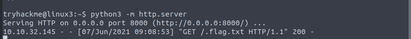
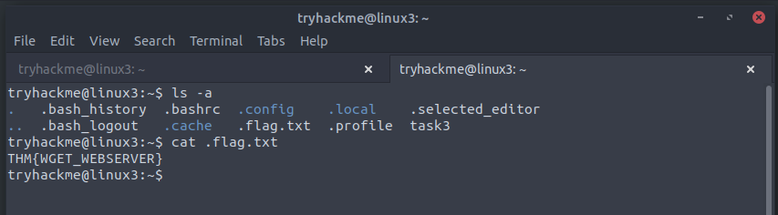

# Linux Fundamentals Part 3

## Task 1 - Introduction
Welcome to part three (and the finale) of the Linux Fundamentals module. So far, throughout the series, you have got hands-on with some fundamental concepts and used some important commands. This room is going to showcase some useful utilities and applications that you are likely to use day-to-day. You're also going to advance your Linux-fu skills by learning about automation, package management, and service/application logging. 

*This task does not require any answers.*

## Task 2 - Deploy your Linux Machine
This will be done using SSH.

*This task does not require any answers.*

## Task 3 - Terminal Text Editors
Two text editors available within the terminal are `nano` and `vim`

**Nano**

In Nano, files can be created using "nano `filename`"
At the end of the window, certain commands are present and they can be accessed using the "Ctrl" key with the corresponding letter

**Vim**

Vim is a much more advanced text editor. Keyboard shortcuts can be customised, Syntax highlighting are some of the features present in Vim

**Question** - Edit "task3" located in "tryhackme"'s home directory using Nano. What is the flag?

**Answer** - THM{TEXT_EDITORS} Once we ssh into the tryhackme account, an `ls` command provides us with the file named "task3".
Running a `nano` command on this file provides us with the flag.

## Task 4 - General/Useful Utilities
The `wget` command allows us to download files from the web over HTTP.

Secure copy or SCP is a means of securely copying files. Unlike the `cp` command, this command allows you to transfer files between 2 computers using the SSH protocol.

Ubuntu machines come pre packaged with Python3, which provides a module called "HTTPServer". This can be setup using `python3 -m http.server`

**Question** - Ensure you are connected to the deployed instance (MACHINE_IP)

**Answer** - ssh tryhackme@MACHINE_IP

**Question** - Now, use Python 3's "HTTPServer" module to start a web server in the home directory of the "tryhackme" user on the deployed instance.

**Answer** - `python -m http.server`

**Question** - Download the file http://MACHINE_IP:8000/.flag.txt onto the TryHackMe AttackBox

**Answer** - We will be using the `wget` command. Command - `wget http://MACHINE_IP:8000/.flag.txt`. Following this, we run a `ls -a` as the file name begins with a full stop and will not show up with a regular `ls` command and we `cat` that file to reveal the flag.

## Task 5 - Processes 101
Processes are managed by the kernal and have an associated ID, known as a `PID`

The `ps` command provides a list of the running processes.

The `ps aux` command can be used to view processes run by other users that don't run from a session

The `top` command gives real time stats on processes running. It refreshes every 10 seconds 

The `kill` command can be used to terminate processes - it is followed by the associated PID number

SIGTERM - Kill the process, but allow it to do cleanup tasks beforehand - used to cleanly kill a process.

SIGKILL - Kill the process but don't do any cleanup

SIGSTOP - Stop/suspend the process

The `systemctl` command can be used to interact with the "systemd" process. Systemctl offers four options - Start, Stop, Enable, Disable

In Linux, processes can be run in two states - foreground and background. 
`Ctrl + Z` on the keyboard can be used to background a process. This can be confirmed using the `ps aux` command. The `&` operator also does the same function. `fg` can be used to bring it back to focus.

**Question** - If we were to launch a process where the previous ID was "300", what would the ID of this new process be?

**Answer** - Processes follow each other in an iterative fashion so the following process ID will be "301"

**Question** - If we wanted to cleanly kill a process, what signal would we send it?

**Answer** - The `SIGTERM` command kills the process and dooes cleanup tasks beforehand

**Question** - Locate the process that is running on the deployed instance (MACHINE_IP). What flag is given?

**Answer** - The flag for this question is "THM{PROCESSES}". This can be found by running the `ps aux` command on the deployed machine and looking for a process seeming out of the ordinary.

**Question** - What command would we use to stop the service "myservice"?

**Answer** - We use the `systemctl` command. In this case, we are looking to stop the "myservice" service, so the syntax would look something like this - "systemctl stop myservice"

**Question** - What command would we use to start the same service on the boot-up of the system?

**Answer** - The key to this question is starting the process on boot. We can do this with the "enable" function. As a result, the syntax would look something like this - "systemctl enable myservice"

**Question** - What command would we use to bring a previously backgrounded process back to the foreground?

**Answer** - This can be done using the foreground command, often shortened to `fg`

## Task 6 - Maintaining your system: Automation
Crontabs can be edited using the `crontab -e` command to select an editor

**Question** - Ensure you are connected to the deployed instance and look at the running crontabs.

**Answer** - This can be looked at using the `crontab -e` command

**Question** - When will the crontab on the deployed instance (MACHINE_IP) run?

**Answer** - @reboot as evidenced in the screenshot

## Task 7 - Maintaining your System: Packet Management

*This task does not require any answers.*

## Task 8 - Maintaining your Systsm: Logs

**Question** - Look for the apache2 logs on the deployable Linux machine
This task does not require any answers. However, we can do so by navigating to where the apache logs that are relevant for this task are located - `cd /var/log/apache2`. This reveals a number of log files, present in the attached screenshot. 

**Question** - What is the IP address of the user who visited the site?

**Answer** - 10.9.232.111 - We get this by opening the relevant log file - `cat access.log.1`

**Question** - What file did they access?

**Answer** - `catsanddogs.jpg` - In the same file as earlier, we see that the user attempted to enforce a GET request for `catsanddogs.jpg`

## Task 9 - Conclusions and Summaries

*This task does not require any answers.*

